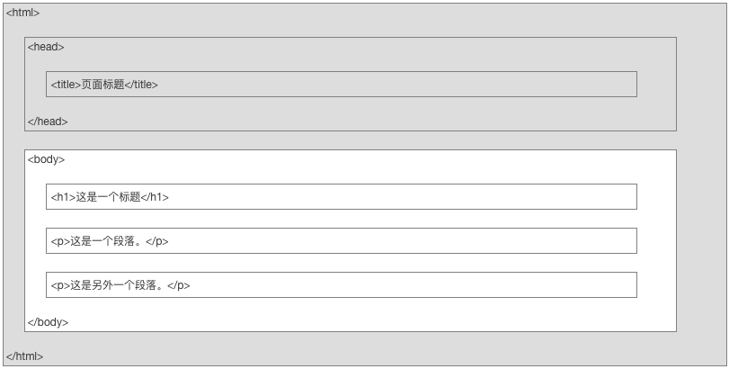
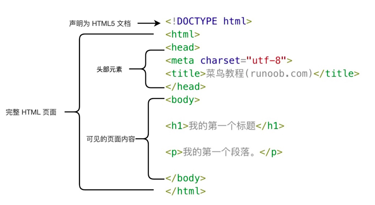
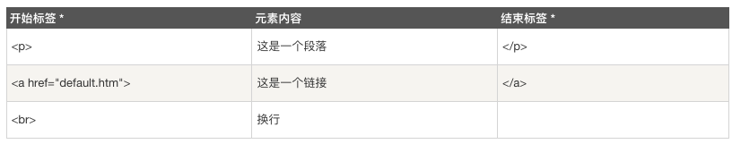

[Toc]

# 如何用HTML创建网页[^1]

[^1]: 这是学习html的个人笔记，是根据[菜鸟教程](https://www.runoob.com)所做

## HTML简介[^date1]

[^date1]: 2021.06.15

### 什么是html

* HTML: hypertext markup language(中文：超文本标记语言)
* 功能于与定位：一种用于`创建网页`或`web站点`的`标准标记语言`(html不是编程)
  * 标记语言是一套标记标签(markup tag)
  * html使用标记标签描述网页
  * html文档包含了html标签和文本内容
  * html文档也被称作`web页面`
  * html运行在浏览器中，并由浏览器简析
    > 标记语言(html)好比中文，一套标记标签(markup tag)好比一个个的汉字，网页(web)好比句子，html文档好比一篇中文文章
* html文件的后缀名：`<.html>`或`<.htm>`，两种后缀名可无区别的加以使用

### html标签(html元素)

* html标记标签又被称做html标签(html tag)
* html标签是由尖括号包围的关键词，如 `<html>`
* html标签通常成堆出现，如`<p>` content `</p>`
* 标签对中的第一个标签是开始标签(开放标签)，第二个标签是结束标签(闭合标签)
* html标签和html元素通常表述相同的意思

### web浏览器

* web浏览器用于读取html文档，并将其作为网页显示
* 浏览器并不直接显示html标签，它通过使用标签来决定如何展现html的页面内容给用户
* 常见的浏览器：Google，Safari，Internet Explorer，Firefox

### 如何查看网页的源代码(打开包含页面html代码的窗口)

* 在网页中`单击右键-选择查看源文件或页面代码源`

### HTML版本

* html发展历程


### HTML的基本结构

* html的页面结构

  * Note：只有`<body>`内的内容才会显示在浏览器中

* html的==源代码==结构

  ```html
  <!DOCTYPE html>
  <html>
  <head>
  <meta charset="utf-8">
  <title>菜鸟教程(runoob.com)</title>
  </head>
  <body>
  <h1>我的第一个标题</h1>
  <p>我的第一个段落。</p>
  </body>
  </html>
  ```

* 含义解释


  * `<!DOCTYPE html>`：用于生命文档为html文档
  * `<html>`：html页面的根元素
  * `<head>`：包含文档的元(meta)数据
  * `<title>`：用于描述文档的标题
  * `<body>`：包含了可见页面的内容
  * `<h1>`：用于定义一个大标题
  * `<p>`：用于定义一个段落

* `<!DOCTYPE>`声明
  * 通过<!DOCTYPE>正确声明html的版本有助于在浏览器中正确显示网页内容[^声明方法]
  [^声明方法]: 声明方式参考[doctype参考手册](https://www.runoob.com/tags/tag-doctype.html)
  * 声明不区分大小写，如下属方式的声明是等价的:

     ```html
     <!DOCTYPE html>
     <!DOCTYPE HTML>
     <!doctype html>
     <!Doctype Html>
     ```

* 中文编码
  * 由于在大部分浏览器中，无法直接输入中文(乱码)，因此对于中文html，需要在html头部中将字符声明为UTF-8或GBK(360浏览器)，修改命令为：`<meta charset="utf-8">` 或`<meta charset="gbk">`

****

## 创建HTML的效率工具

### VScode[^download_site_vs]

[^download_site_vs]: VScode下载地址：https://code.visualstudio.com/

VScode全称visual Studio Code，作为`开放源代码`的`代码编辑器`，它由微软开发，并同时支持Windows, Linux, MacOS等多种平台的操作系统，它内置的拓插件功能使它能够作为各种代码程序的编辑器而备受青睐。

### Emmet插件[^site_em]

[^site_em]: Emmet官网：http://emmet.io/

* Emmet的出现大大提高了编码的速度，对于相应的使用方法可以参考官网的[说明手册](http://emmet.io/)

### Live Sever插件

* Live Sever可以实时查看编程的呈现结果
* 使用方法：
  * 点击右键，选择Open With Live Sever即可，或者使用快捷键 `Command L + Command O`
* ==注意事项==：
  * 使用Live Sever需要选择默认浏览器，这里可以进入VScode的设置-拓展-Live Sever Config中进行设置
  * 在使用Live Sever时，应该把包含html的整个文件夹一同放进VScode，否则会无法通过Live Sever打开html并进行实时预览
  * 实时预览的前提是代码已经被保存，可以每次手动保存或`command+A`，也可以通过`file-自动保存`设置成自动保存

****

# 用HTML创建网页的细节描述

## HTML基础

****

### HTML标题(heading)

* HTML通过标签`<h*>`定义标题，*代表1-6的数字，是几就是及级标题，最多6级标题
* 例如：

  ```html
  <body>

  <h1>title</h1>
  <h2>title</h2>
  <h3>title</h3>
  <h4>title</h4>
  <h5>title</h5>
  <h6>title</h6>

  </body>
  ```

### HTML段落

* HTML通过标签`<p>`定义
* 例如：

  ```html
  <body>

  <p>this is paragraph 1</p>
  <p>this is paragraph 2</p>

  </body>
  ```

### HTML链接

* HTML通过标签`<a>`定义

  ```html
  <body>

  <a href="https://www.runoob.com/html/html-basic.html">如何使用链接</a>

  </body>
  ```

  * Note：`href`属性用于指定链接地址

### HTML图像

* HTML通过标签``定义

  ```html
  <body>

  

  </body>
  ```

* 根据图片相对于html文档的位置的不同，引用的命令`src`也有所不同，[==后期补充==](https://www.runoob.com/html/html-basic.html)
* `href`与`src`的区别:
  * href是hypertext reference的缩写，表示超文本`引用`，用来建立当前元素与其它文档之间的链接，常用于`link`和`a`标签中
  * scr是source的缩写，它指向的内容会被`嵌入`到当前文档的当前标签位置，常用于`img`,`script`,`iframe`标签中

****

## HTML元素[^date2]

[^date2]: 2021.06.17

之前说过，html元素称做html标签，它是由起始标签(opening tag)和闭合标签(closing tag)构成，如下图：



### html元素语法

* html元素以开始标签起始，以就结束标签终止
  * html元素(标签)对大小写不敏感，如`<P>`等同于`<p>`，但是万维网联盟(W3C)在html4中推荐小写，且在xhtml和xml都强制使用小写
* 元素的内容是开始标签和结束标签之间的内容
* html元素允许具有空内容(empty content)，称为html空元素
  * 空元素是在开始标签中进行关闭(以开始标签的结束而结束)
  * `<br>`就是空元素，但是类似`<br/>`在开始元素中添加反斜杠是关闭额空元素的最正确做法
  * xhtml,xml要求所有的元素都必须被关闭，对于空元素，它们都接受类似`<br/>`的关闭方法
* 大多数html元素具有属性

### 嵌套的html元素

* 大多数html元素可以嵌套，及html元素可以包含其它html元素
* html文档由相互嵌套的html元素构成

### html元素的一些实例

  ```html
  <!DOCTYPE html>
  <html>

  <body>
  <h1>我的第一个标题</h1>
  </body>

  </html>
  ```

* `<p> </p>`元素定义了html文档中的一个段落
* `<body> </body>`元素定义了html文档的主体
* `<html> </html>`元素定义了整个html文档

****

## html属性

### 属性的定义和相关性质

* 属性是html元素提供的附加信息
* html元素可以设置属性
* 属性可以在元素中附加信息
* 属性一般在开始标签中使用
* 属性总是以名称/值对的形式出现，如：`key=“value”`
* 实例：`<a href="http://www.runoob.com">这是一个链接</a>`，这里的`href`是链接属性

### 关于属性的注意事项

* 使用小写属性和属性值，尽管属性对大小写不敏感，但是万维网联盟(W3C)在html4中推荐小写，且在xhtml和xml都强制使用小写
* 属性值要被包括在双单引号内(通常用双引号)，如：`"value"`
* 当属性值本身就含有当双引号时，必须使用单引号，如：`name='gray "solow" becker'`

### 适用于大多数html的属性

* `class`：用于为html元素定义一个或多个类名(classname)(类名从样式文件引入)
  * ***`class=" "`内可以同时写入多个class属性***
* `id`：用于定义元素的唯一id
  * ***`id=" "`内只能写入一个属性***
* `style`：用于规定元素的行内样式（inline style)
* `title`：用于描述元素的额外信息，以作为工具条使用

### 更多属性内容的参考资料

* 完整的html属性列表：[html标签参考手册](https://www.runoob.com/tags/html-reference.html)
* 更多标准属性使用说明：[html标准属性参考手册](https://www.runoob.com/tags/ref-standardattributes.html)

****

## html标题

### html中如何写标题

* 标题(heading)是通过`<h1>到<h6>`的标签进行定义的，共六级标题，其中`<h1>`定义最大的标题，`<h6>`定义最小的标题
  * 浏览器会自动的在标题后面的前后添加空行
  * **搜索引擎使用标题为网页的结构和内容编制索引**，以提供给用户通过标题来快速浏览网页，所以用标题来呈现围挡结构是重要的

### 与html标题元素搭配使用的其它html元素(标签)

* `<br/>`：用于换行
* `<hr/>`：用于在html中穿件水平线，以此用来分割内容
* `<！-- content -->`：用于在html中添加注释，以提高代码的可读性，且浏览器不会编译它们
* 例子：

  ```html
  <!DOCTYPE html>
  <html>
  <head>
  <meta charset="utf-8">
  <title>菜鸟教程(runoob.com)</title>
  </head>
  <body>

    <p> aaaaa </p>
    <hr/>
          <p> bb <hr/> bbb </p>
    <!-- 如何使用注释-->
    <!-- note：浏览器会忽略源代码中的排版，即会省略多余的空格和换行-->

  </body>
  </html>
  ```

* 1到6号标题于6到1好字体对应，即6号字体最大，1号字体最小，而标题中，1号白噢题最大，6号标题最小，如：

  ```html
  <!DOCTYPE html>
  <html>
  <head>
  <meta charset="utf-8">
  <title>菜鸟教程(runoob.com)</title>
  </head>
  <body>
  <h1>title</h1>
  <font size="6"> title</font>

  <h2>title</h2>
  <h3>title</h3>
  <h4>title</h4>
  <h5>title</h5>

  <h6>title</h6>
  <font size="1"> title</font>

  </body>
  </html>
  ```

****

## html段落

### html中的段落标签

* 通过`<p> content <p/>`定义段落，以此用来将html分档分为若干段落

### html换行(折行)

* `<br/>`用于在不产生新的段落的情况下进行换行
例如： `<p> bb <hr/> bbb </p>`

### 注意问题

* 屏幕大小，浏览器窗口的调整都会影响html被显示被显示的效果
* 在html中，无法通过在html代码中添加额外的空格或换行来改变输出结果
* 显示html页面时，浏览器会一处源代码中多余的空格和空行，所有连续的空格/空行/换行都只会被算作一个空格
* 例子：

  ```html
  <!DOCTYPE html>
  <html>
  <body>

  <p>
  aaa
    aaa
      aaa
  </p>

  <p>
  aaa    a        aaaa


  aaaa<br/><br/>aaaaa
  </p>

  </body>
  </html>
  ```

****

## html格式化

### html格式化标签定义

* html中对输出的文本进行格式设定的标签被称作格式化标签
* 更多关于html标签的内容，参考《[html标签参考手册](https://www.runoob.com/tags/html-reference.html)》

### html文本格式化的例子

* `<i> </i>`： 定义斜体，如，`<i> content </i>`
  * `<strong></strong>`标签定义加重语气，常被用来替换`<i> </i>`
* `<b> </b>`：定义加粗，如，`<b> content </b>`
  * `<em></em>`标签定义着重文字，常被用来替换`<b> </b>`
* `<sub> </sub>`：定义下标，如，`<sub> content </sub>`
* `<sup> </sup>`：定义上标，如，`<sup> content </sup>`
* `<small> </small>`：定义小子号
* `<big> </big>`：定义大子号
* `<ins> </ins>`：定义插入子
* `<del> </del>`：定义删除字

  ```html
  <!DOCTYPE html>
  <html>
  <head>
  <meta charset="utf-8">
  <title>菜鸟教程(runoob.com)</title>
  </head>
  <body>

  <P>

  <b>加粗文本</b> <br/>
  <strong>同样是加粗文本</strong> <br/>
  <i>斜体文本</i> <br/>
  <em>同样是斜体文本</em> <br/>
  <small>小字体文本</small> <br/>
  <big>大字体文本</big> <br/>
  <sub>展示下标文本</sub> <br/>
  <sup>展示下标文本</sup> <br/>
  <ins>插入文本</ins> <br/>
  <del>删除文本</del>

  </P>

  </body>
  </html>
  ```

### html计算机输出字体格式标签例子(计算机或编程代码显示格式标签)

* `<code> </code>`：定义计算机代码
* `<kbd> </kbd>`：定义键盘码
* `<samp> </samp>`：定义计算机代码样本
* `<var> </var>`：定义变量
* `<pre> </pre>`：定义预格式文本
* 例子：

  ```html
  <!DOCTYPE html>
  <html>
  <head>
  <meta charset="utf-8">
  <title>菜鸟教程(runoob.com)</title>
  </head>
  <body>

  <P>

  <code> 计算机输出文本字体样式</code> <br/>
  <kbd> 键盘输出文本字体样式</kbd> <br/>
  <tt> 打字机输出文本字体样式</tt> <br/>
  <samp> 计算机代码样本输出文本字体样式</samp> <br/>
  <var> 计算机变量输出文本字体样式 </var> <br/>
  <pre>pre标签用于对空行       和空格            进行控制</pre>

  </P>

  </body>
  </html>
  ```

### html 引文/引用/定义 标签例子

* `<abbr title=""> </abbr>`：定义缩写，某些浏览器中，当把鼠标放在缩写词上时，会显示缩写词的完整版本
* `<address> </address>`：定义地址
* `<bdo dir=""> </bdo>`：定义文字方向
* `<blockquote> </blockquote>`：定义长的引用(块引用)
* `<q> </q>`：定义短的引用(块引用)
* `<cite> </cite>`：定义引用/引证
* `<dfn> </dfn>`：定义一个定义项目
* 例子：

  ```html
  <!DOCTYPE html>
  <html>
  <head>
  <meta charset="utf-8">
  <title>菜鸟教程(runoob.com)</title>
  </head>
  <body>

  <P>

    <abbr title="National Bureau of Economic Research"> NBER </abbr>
  <P>
    <address>
      145 anam-ro seongbuk-gu <br/>
      seoul 02841 <br/>
      korea
    </address>
  </P>
  <p>
    文字方向 <br/>
    <bdo dir="rtl"> 文字方向 </bdo>
  </p>
  <p>
    鲁迅说：
    <q>有一分热，发一份光。</q>
  </p>

  </P>

  </body>
  </html>
  ```

****

## html链接

### html链接的作用与链接语法

* html通过超级链接与另一个文档产生关联，从而实现点击链接可以实现从一个页面跳转到另一个页面
* 在html文档中创建链接的链接语法： 使用`<a> </a>`标签
  * 具体形式为：`<a href="resource"> content </a>`
  * `resource`既可以是普通的url，也可以是文档图片(pdf,docx，image)，如例子中所示
  * `content`内容可以是任何东西(字，图等)，它们只是从当前文档或标签转到另一文档或当前文档的某一部分的一个中介，通过点击这些内容可以跳转到相应内容
  * 通过`href`属性标记链接的地址(目标)
  * 当把鼠标移动到链接上时，箭头会变成小手指示
  * 默认情况下，未访问过的链接显示为带有下划线的蓝色字体，访问过的链接显示为带有下划线的紫色字体；如果专门设置了相应的CSS样式，展示样式会根据CSS的设定而显示
* 使用`target`属性可以指定被链接的文档在何处显示
* 例子：

  ```html
  <!DOCTYPE html>
  <html>
  <head>
  <meta charset="utf-8">
  <title>菜鸟教程(runoob.com)</title>
  </head>
  <body>

  <P>

  <a href="https://www.runoob.com/html/html-basic.html">如何使用链接</a>
  <a href="aaa.pdf" target="_blank"> pdf </a>
  <a href="aaa.docx" target="_blank"> docx </a>
  <!--docx时会直接下载，而pdf时会在新页面直接打开-->
  <a href="aaa.png" target="_blank"> image </a>

  <!--图片链接-->
  <a href="https://lesliezj09.github.io/Leslie/">
  
  </a>

  <!--内部链接-->
  <a id="tips"> 通过id属性创建在当前html文档内的书签标记(内部链接)，当前页面连接到指定位置 </a>
  <!--放到要内部链接的部分 -->
  <a href="#tips"> 内部链接 </a>

  <!--电子邮件-->
  <a href="mailto:jianzhang@korea.ac.kr?Subject=my%20email" target="_top">我的电子邮箱</a>
  <!--单词之间的空格用%20代替，用来确保浏览器可以正常显示文本-->

  <!--电子邮件：抄送/密送/主体/文字内容-->
  <a href="mailto:jianzhang@korea.ac.kr?cc=geon_jang@naver.cpm&bcc=jianzhang@korea.ac.kr&Subject=my%20email&body=we%20are%20family" target="_top">电子邮箱</a>

  <embed width="800" height="600" src="aaa.pdf"> </embed>
  <!--会直接在当前页面以展示窗口的形式引入-->
  <iframe src="bbb.pdf" width="800" height="600"> </iframe>

  </P>

  </body>
  </html>
  ```

### 创建电子邮件链接时的格式

* 创建电子邮件链接时的href属性
  * `mailto: 邮件地址`：邮件发送对象或者接收地址
  * `cc=邮件地址`：抄送地址(carbon copy)
  * `bcc=邮件地址`：密送地址(blind carbon copy)
  * `subject=邮件主题内容`：邮件主题
  * `body=邮件内容`：邮件内容
  * `?`：第一个参数分隔符
  * `&`：其它参数分隔符
  * `;`：多个邮件地址用；隔开
  * `%20`：空格用%20代替
* 创建电子邮件链接时`<a></a>`标签的`ref`属性的属性值
  * `nofollow`属性值：告诉搜索引擎不要追踪此网页上的链接，即告诉搜索引擎这个链接没有得到作者信任
  * `noopener noreferrer`属性值：不会打开其它网站，防止其它网站的恶意病毒

****

## html头部(head)

### html的head元素的作用

* `<head></head>`元素能够包含所有的头部标签
* `<title>，<style>，<meta>，<link>，<script>(脚本)，<noscript>，<base>`，`<CSS>(样式文件)`等标签都可以作为头部元素的标签插入头部
* `<head></head>与<header></header>`标签的差异
  * `<head></head>`标签用于定于文档头部，是所有头部元素的容器
  * `<header></header>`标签用于定义文档的页眉(作为介绍信息)

### html的`<title>`标签

* 定义了文档的标题，且在html和xhtml文档中是必须标记的
* 用途：是浏览器工具栏的标题，是搜索引擎结果页面的标题，是在收藏夹中显示的标题
* 例子：

  ```html
  <!DOCTYPE html>
  <html>

  <head>
  <meta charset="utf-8">
  <title>title标签例子</title>
  </head>

  <body>
  <p>这里是head元素中title标签的例子</p>
  </body>
  </html>
  ```

### html的`<base>`标签

* 定义了当前html文档中所有链接标签的默认链接地址或目标，类似于默认的文件路径
* 例子：

  ```html
  <!DOCTYPE html>
  <html>

  <head>
  <meta charset="utf-8">
  <title>title标签例子</title>
  <base href="//www.runoob.com/images/" target="_blank">
  </head>
  <body>

  
  图片的访问地址为 "http://www.runoob.com/images/logo.png"

  <a href="//www.runoob.com">菜鸟教程</a>
  base 标签里已经设置了 target 属性的值为 "_blank"。
  </body>
  </html>
  ```

### html的`<link>`标签

* 定义了文档与外部资源之间的联系
* 通常用于链接到样式表，当然也可以用于链接到别的内容/图片
* 例子：`<head> <link rel="stylesheet" type="text/css" href="my_style.css"> </head>`
* `rel`属性：规定当前文档与被链接文档或资源之间的关系，是一个必须项，语法：`link rel="value"`，常见的属性值：
  * alternate：链接到文档的替代版本(如，打印页/翻译/镜像)
  * author：链接到该文档的作者
  * help：链接到帮助文档
  * icon：导入该文档的图标
  * license：链接到该文档的版权信息
  * next：表示该文档是集合中的一部分，且集合中的下一个文档是被引用等我文档
  * prefetch：规定应该对目标资源进行缓存
  * prev：表示该文档是集合中的一部分，且集合中的上一个文档是被引用等我文档
  * search：链接针对文档的搜索工具
  * stylesheet：要倒入的样式表的url

### html的`<style>`标签

* 定义了html文档的样式文件
* 在style标签可以直接添加样式文件的引用地址
* 在style标签中也可以直接添加样式来渲染html文档
* 例子：

  ```html
  <head>
    <style type="text/css">
    body {background-color: yellow}
    h1 {color:red}
    p {color:blue}
    </style>
  </head>
  ```

### html的`<meta>`标签

* 定义(描述)了html文档中的(基本的)元数据
* 通常用于指定网页的描述/关键词/文件的最后修改时间/作者/字符集等元数据
* 元数据可使用于浏览器(告诉浏览球如何显示内容或重新加载页面)/搜索引擎(关键词)/其它web服务
* 元数据不会在页面显示，但会被浏览器解析
* 例子：

```html
定义网页描述的内容：
<meta name="description" content="html教程">

定义搜索引擎的关键词：
<meta name="keywords" content="html, CSS, JavaScript">

定义网页的作者：
<meta name="author" content="David">

定义浏览器重新加载页面的时间：
<meta http-equiv="refresh" content="30">
<!--没30秒刷新一次当前页面-->
```

### html的`<script>`标签

* 定义了客户端的脚本文件或用于加载脚本文件，如JavaScript
* Note参见后面的脚本介绍

****

## html样式(CSS)

### 什么是CSS

### 如何使用CSS

****

## html图像

### html图像标签

* `<image>`：图像标签
  * 空标签，只包含属性，无闭合标签
* 语法：`<image scr="url" alt="">`
* 浏览器会将图像显示在html文档中图像标签出现的地方
  * 插入图像时，需要正确设置图像的路径，否则浏览器无法加载，此时加载时会显示一个破碎的图片

### html图像标签的属性

* `scr`属性：称做源属性，src指source，使用语法：scr="value"，其中属性值是图像的地址(地址可以是url地址，也可以是文件夹内的相对或绝对地址)
* `alt`属性：称做替代文本属性，它用来为图像定义一串预备的可替换的文本，以用来告诉当浏览器无法加载图像时，失去的信息是什么，即无法加载图片时，浏览器会显示这个替代性的文本，使用语法：alt="value"，其中的属性值用户自己定义即可
* `width`和`height`属性：设置图像的宽度和高度
  * 默认值：width=“304”，height=“228”
  * 当指定了图像的宽度和高度时，页面下载时会保留指定的尺寸，而没有指定时，页面加载时有可能破坏html页面的整体布局

### 三种图像标签

* ``：定义图片
* `<map>`：定义图像地图
* `<area>`：定义图像地图中的可点击区域

### html图像标签不同场景的使用例子

* 排列图片

  ```html
  <p>图片测试结果</p>
  <p>图片测试结果</p>
  <p>图片测试结果</p>
  <!--html5中已经不支持align属性，排列可通过css设置-->
  ```

* 浮动图像

  ```html
  <p>图片测试记结</p>
  <p>图片测试结果</p>
  <!--html5中已经不支持float属性，排列可通过css设置；float：right已经不能使用-->
  ```

* 设置图像作为链接

```html
  <a href="https://lesliezj09.github.io/Leslie/">
    
    <br/>
    
  </a>
```

* 创建图像映射：创建带有点击区域的图像地图，每个点击区域都是一个链接

```html
  
  <map name="travel">
      <area shape="circle" coords="100,50,40" href="aaa1.JPG" alt="sky">
      <area shape="rect" coords="150,150,200,200" href="aaa2.JPG" alt="ocean and land">
      <area shape="circle" coords="90,180,40" href="aaa3.JPG" alt="baby">
      <!--
          shape：链接(点击)区域的形状
          coords：链接区域在图片中的坐标(以左上角为坐标中心，像素为单位)

          rect：矩形，左上角顶点坐标为(x1,y1),右下角顶点坐标为(x2,y1)
                <area shape="rect" coords="x1,y1,x2,y2" href=url>

          circle：圆形，圆心坐标为：(x1,y2),半径为r
                  <area shape="circle" coords="x1,y1,r" href=url>

          poly：多边形，各顶点的坐标依次为: (x1,y1)/(x2,y2)/(x3,y3)...
                <area shape="poly" coords="x1,y1,x2,y2 ......" href=url>
      -->
  </map>
```

****

## html表格

### html表格标签

### html表格的属性


