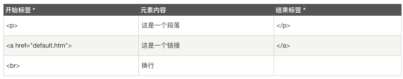

[Toc]

# 如何用HTML创建网页[^1]

[^1]: 这是学习html的个人笔记，是根据[菜鸟教程](https://www.runoob.com)所做

## HTML简介[^date1]

[^date1]: 2021.06.15

### 什么是html

* HTML: hypertext markup language(中文：超文本标记语言)
* 功能于与定位：一种用于`创建网页`或`web站点`的`标准标记语言`(html不是编程)
  * 标记语言是一套标记标签(markup tag)
  * html使用标记标签描述网页
  * html文档包含了html标签和文本内容
  * html文档也被称作`web页面`
  * html运行在浏览器中，并由浏览器简析
    > 标记语言(html)好比中文，一套标记标签(markup tag)好比一个个的汉字，网页(web)好比句子，html文档好比一篇中文文章
* html文件的后缀名：`<.html>`或`<.htm>`，两种后缀名可无区别的加以使用

### html标签(html元素)

* html标记标签又被称做html标签(html tag)
* html标签是由尖括号包围的关键词，如 `<html>`
* html标签通常成堆出现，如`<p>` content `</p>`
* 标签对中的第一个标签是开始标签(开放标签)，第二个标签是结束标签(闭合标签)
* html标签和html元素通常表述相同的意思

### web浏览器

* web浏览器用于读取html文档，并将其作为网页显示
* 浏览器并不直接显示html标签，它通过使用标签来决定如何展现html的页面内容给用户
* 常见的浏览器：Google，Safari，Internet Explorer，Firefox

### 如何查看网页的源代码(打开包含页面html代码的窗口)

* 在网页中`单击右键-选择查看源文件或页面代码源`

### HTML版本

* html发展历程


### HTML的基本结构

* html的页面结构

  * Note：只有`<body>`内的内容才会显示在浏览器中

* html的==源代码==结构

  ```html
  <!DOCTYPE html>
  <html>
  <head>
  <meta charset="utf-8">
  <title>菜鸟教程(runoob.com)</title>
  </head>
  <body>
  <h1>我的第一个标题</h1>
  <p>我的第一个段落。</p>
  </body>
  </html>
  ```

* 含义解释


  * `<!DOCTYPE html>`：用于生命文档为html文档
  * `<html>`：html页面的根元素
  * `<head>`：包含文档的元(meta)数据
  * `<title>`：用于描述文档的标题
  * `<body>`：包含了可见页面的内容
  * `<h1>`：用于定义一个大标题
  * `<p>`：用于定义一个段落

* `<!DOCTYPE>`声明
  * 通过<!DOCTYPE>正确声明html的版本有助于在浏览器中正确显示网页内容[^声明方法]
  [^声明方法]: 声明方式参考[doctype参考手册](https://www.runoob.com/tags/tag-doctype.html)
  * 声明不区分大小写，如下属方式的声明是等价的:

     ```html
     <!DOCTYPE html>
     <!DOCTYPE HTML>
     <!doctype html>
     <!Doctype Html>
     ```

* 中文编码
  * 由于在大部分浏览器中，无法直接输入中文(乱码)，因此对于中文html，需要在html头部中将字符声明为UTF-8或GBK(360浏览器)，修改命令为：`<meta charset="utf-8">` 或`<meta charset="gbk">`

****

## 创建HTML的效率工具

### VScode[^download_site_vs]

[^download_site_vs]: VScode下载地址：https://code.visualstudio.com/

VScode全称visual Studio Code，作为`开放源代码`的`代码编辑器`，它由微软开发，并同时支持Windows, Linux, MacOS等多种平台的操作系统，它内置的拓插件功能使它能够作为各种代码程序的编辑器而备受青睐。

### Emmet插件[^site_em]

[^site_em]: Emmet官网：http://emmet.io/

* Emmet的出现大大提高了编码的速度，对于相应的使用方法可以参考官网的[说明手册](http://emmet.io/)

### Live Sever插件

* Live Sever可以实时查看编程的呈现结果
* 使用方法：
  * 点击右键，选择Open With Live Sever即可，或者使用快捷键 `Command L + Command O`
* ==注意事项==：
  * 使用Live Sever需要选择默认浏览器，这里可以进入VScode的设置-拓展-Live Sever Config中进行设置
  * 在使用Live Sever时，应该把包含html的整个文件夹一同放进VScode，否则会无法通过Live Sever打开html并进行实时预览
  * 实时预览的前提是代码已经被保存，可以每次手动保存或`command+A`，也可以通过`file-自动保存`设置成自动保存

****

# 用HTML创建网页的细节描述

## HTML基础

****

### HTML标题(heading)

* HTML通过标签`<h*>`定义标题，*代表1-6的数字，是几就是及级标题，最多6级标题
* 例如：

  ```html
  <body>

  <h1>title</h1>
  <h2>title</h2>
  <h3>title</h3>
  <h4>title</h4>
  <h5>title</h5>
  <h6>title</h6>

  </body>
  ```

### HTML段落

* HTML通过标签`<p>`定义
* 例如：

  ```html
  <body>

  <p>this is paragraph 1</p>
  <p>this is paragraph 2</p>

  </body>
  ```

### HTML链接

* HTML通过标签`<a>`定义

  ```html
  <body>

  <a href="https://www.runoob.com/html/html-basic.html">如何使用链接</a>

  </body>
  ```

  * Note：`href`属性用于指定链接地址

### HTML图像

* HTML通过标签``定义

  ```html
  <body>

  

  </body>
  ```

* 根据图片相对于html文档的位置的不同，引用的命令`src`也有所不同，[==后期补充==](https://www.runoob.com/html/html-basic.html)
* `href`与`src`的区别:
  * href是hypertext reference的缩写，表示超文本`引用`，用来建立当前元素与其它文档之间的链接，常用于`link`和`a`标签中
  * scr是source的缩写，它指向的内容会被`嵌入`到当前文档的当前标签位置，常用于`img`,`script`,`iframe`标签中

****

## HTML元素[^date2]

[^date2]: 2021.06.17

之前说过，html元素称做html标签，它是由起始标签(opening tag)和闭合标签(closing tag)构成，如下图：



### html元素语法

* html元素以开始标签起始，以就结束标签终止
  * html元素(标签)对大小写不敏感，如`<P>`等同于`<p>`，但是万维网联盟(W3C)在html4中推荐小写，且在xhtml和xml都强制使用小写
* 元素的内容是开始标签和结束标签之间的内容
* html元素允许具有空内容(empty content)，称为html空元素
  * 空元素是在开始标签中进行关闭(以开始标签的结束而结束)
  * `<br>`就是空元素，但是类似`<br/>`在开始元素中添加反斜杠是关闭额空元素的最正确做法
  * xhtml,xml要求所有的元素都必须被关闭，对于空元素，它们都接受类似`<br/>`的关闭方法
* 大多数html元素具有属性

### 嵌套的html元素

* 大多数html元素可以嵌套，及html元素可以包含其它html元素
* html文档由相互嵌套的html元素构成

### html元素的一些实例

  ```html
  <!DOCTYPE html>
  <html>

  <body>
  <h1>我的第一个标题</h1>
  </body>

  </html>
  ```

* `<p> </p>`元素定义了html文档中的一个段落
* `<body> </body>`元素定义了html文档的主体
* `<html> </html>`元素定义了整个html文档

****

## html属性

### 属性的定义和相关性质

* 属性是html元素提供的附加信息
* html元素可以设置属性
* 属性可以在元素中附加信息
* 属性一般在开始标签中使用
* 属性总是以名称/值对的形式出现，如：`key=“value”`
* 实例：`<a href="http://www.runoob.com">这是一个链接</a>`，这里的`href`是链接属性

### 关于属性的注意事项

* 使用小写属性和属性值，尽管属性对大小写不敏感，但是万维网联盟(W3C)在html4中推荐小写，且在xhtml和xml都强制使用小写
* 属性值要被包括在双单引号内(通常用双引号)，如：`"value"`
* 当属性值本身就含有当双引号时，必须使用单引号，如：`name='gray "solow" becker'`

### 适用于大多数html的属性

* `class`：用于为html元素定义一个或多个类名(classname)(类名从样式文件引入)
  * ***`class=" "`内可以同时写入多个class属性***
* `id`：用于定义元素的唯一id
  * ***`id=" "`内只能写入一个属性***
* `style`：用于规定元素的行内样式（inline style)
* `title`：用于描述元素的额外信息，以作为工具条使用

### 更多属性内容的参考资料

* 完整的html属性列表：[html标签参考手册](https://www.runoob.com/tags/html-reference.html)
* 更多标准属性使用说明：[html标准属性参考手册](https://www.runoob.com/tags/ref-standardattributes.html)

****

## html标题

### html中如何写标题

* 标题(heading)是通过`<h1>到<h6>`的标签进行定义的，共六级标题，其中`<h1>`定义最大的标题，`<h6>`定义最小的标题
  * 浏览器会自动的在标题后面的前后添加空行
  * **搜索引擎使用标题为网页的结构和内容编制索引**，以提供给用户通过标题来快速浏览网页，所以用标题来呈现围挡结构是重要的

### 与html标题元素搭配使用的其它html元素(标签)

* `<br/>`：用于换行
* `<hr/>`：用于在html中穿件水平线，以此用来分割内容
* `<！-- content -->`：用于在html中添加注释，以提高代码的可读性，且浏览器不会编译它们
* 例子：

  ```html
  <!DOCTYPE html>
  <html>
  <head>
  <meta charset="utf-8">
  <title>菜鸟教程(runoob.com)</title>
  </head>
  <body>

    <p> aaaaa </p>
    <hr/>
          <p> bb <hr/> bbb </p>
    <!-- 如何使用注释-->
    <!-- note：浏览器会忽略源代码中的排版，即会省略多余的空格和换行-->

  </body>
  </html>
  ```

* 1到6号标题于6到1好字体对应，即6号字体最大，1号字体最小，而标题中，1号白噢题最大，6号标题最小，如：

  ```html
  <!DOCTYPE html>
  <html>
  <head>
  <meta charset="utf-8">
  <title>菜鸟教程(runoob.com)</title>
  </head>
  <body>
  <h1>title</h1>
  <font size="6"> title</font>

  <h2>title</h2>
  <h3>title</h3>
  <h4>title</h4>
  <h5>title</h5>

  <h6>title</h6>
  <font size="1"> title</font>

  </body>
  </html>
  ```

****

## html段落

### html中的段落标签

* 通过`<p> content <p/>`定义段落，以此用来将html分档分为若干段落

### html换行(折行)

* `<br/>`用于在不产生新的段落的情况下进行换行
例如： `<p> bb <hr/> bbb </p>`

### 注意问题

* 屏幕大小，浏览器窗口的调整都会影响html被显示被显示的效果
* 在html中，无法通过在html代码中添加额外的空格或换行来改变输出结果
* 显示html页面时，浏览器会一处源代码中多余的空格和空行，所有连续的空格/空行/换行都只会被算作一个空格
* 例子：

  ```html
  <!DOCTYPE html>
  <html>
  <body>

  <p>
  aaa
    aaa
      aaa
  </p>

  <p>
  aaa    a        aaaa


  aaaa<br/><br/>aaaaa
  </p>

  </body>
  </html>
  ```

****

## html格式化

### html格式化标签定义

* html中对输出的文本进行格式设定的标签被称作格式化标签
* 更多关于html标签的内容，参考《[html标签参考手册](https://www.runoob.com/tags/html-reference.html)》

### html文本格式化的例子

* `<i> </i>`： 定义斜体，如，`<i> content </i>`
  * `<strong></strong>`标签定义加重语气，常被用来替换`<i> </i>`
* `<b> </b>`：定义加粗，如，`<b> content </b>`
  * `<em></em>`标签定义着重文字，常被用来替换`<b> </b>`
* `<sub> </sub>`：定义下标，如，`<sub> content </sub>`
* `<sup> </sup>`：定义上标，如，`<sup> content </sup>`
* `<small> </small>`：定义小子号
* `<big> </big>`：定义大子号
* `<ins> </ins>`：定义插入子
* `<del> </del>`：定义删除字

  ```html
  <!DOCTYPE html>
  <html>
  <head>
  <meta charset="utf-8">
  <title>菜鸟教程(runoob.com)</title>
  </head>
  <body>

  <P>

  <b>加粗文本</b> <br/>
  <strong>同样是加粗文本</strong> <br/>
  <i>斜体文本</i> <br/>
  <em>同样是斜体文本</em> <br/>
  <small>小字体文本</small> <br/>
  <big>大字体文本</big> <br/>
  <sub>展示下标文本</sub> <br/>
  <sup>展示下标文本</sup> <br/>
  <ins>插入文本</ins> <br/>
  <del>删除文本</del>

  </P>

  </body>
  </html>
  ```

### html计算机输出字体格式标签例子(计算机或编程代码显示格式标签)

* `<code> </code>`：定义计算机代码
* `<kbd> </kbd>`：定义键盘码
* `<samp> </samp>`：定义计算机代码样本
* `<var> </var>`：定义变量
* `<pre> </pre>`：定义预格式文本
* 例子：

  ```html
  <!DOCTYPE html>
  <html>
  <head>
  <meta charset="utf-8">
  <title>菜鸟教程(runoob.com)</title>
  </head>
  <body>

  <P>

  <code> 计算机输出文本字体样式</code> <br/>
  <kbd> 键盘输出文本字体样式</kbd> <br/>
  <tt> 打字机输出文本字体样式</tt> <br/>
  <samp> 计算机代码样本输出文本字体样式</samp> <br/>
  <var> 计算机变量输出文本字体样式 </var> <br/>
  <pre>pre标签用于对空行       和空格            进行控制</pre>

  </P>

  </body>
  </html>
  ```

### html 引文/引用/定义 标签例子

* `<abbr title=""> </abbr>`：定义缩写，某些浏览器中，当把鼠标放在缩写词上时，会显示缩写词的完整版本
* `<address> </address>`：定义地址
* `<bdo dir=""> </bdo>`：定义文字方向
* `<blockquote> </blockquote>`：定义长的引用(块引用)
* `<q> </q>`：定义短的引用(块引用)
* `<cite> </cite>`：定义引用/引证
* `<dfn> </dfn>`：定义一个定义项目
* 例子：

  ```html
  <!DOCTYPE html>
  <html>
  <head>
  <meta charset="utf-8">
  <title>菜鸟教程(runoob.com)</title>
  </head>
  <body>

  <P>

    <abbr title="National Bureau of Economic Research"> NBER </abbr>
  <P>
    <address>
      145 anam-ro seongbuk-gu <br/>
      seoul 02841 <br/>
      korea
    </address>
  </P>
  <p>
    文字方向 <br/>
    <bdo dir="rtl"> 文字方向 </bdo>
  </p>
  <p>
    鲁迅说：
    <q>有一分热，发一份光。</q>
  </p>

  </P>

  </body>
  </html>
  ```

****

## html链接

### html链接的作用与链接语法

* html通过超级链接与另一个文档产生关联，从而实现点击链接可以实现从一个页面跳转到另一个页面
* 在html文档中创建链接的链接语法： 使用`<a> </a>`标签
  * 具体形式为：`<a href="resource"> content </a>`
  * `resource`既可以是普通的url，也可以是文档图片(pdf,docx，image)，如例子中所示
  * `content`内容可以是任何东西(字，图等)，它们只是从当前文档或标签转到另一文档或当前文档的某一部分的一个中介，通过点击这些内容可以跳转到相应内容
  * 通过`href`属性标记链接的地址(目标)
  * 当把鼠标移动到链接上时，箭头会变成小手指示
  * 默认情况下，未访问过的链接显示为带有下划线的蓝色字体，访问过的链接显示为带有下划线的紫色字体；如果专门设置了相应的CSS样式，展示样式会根据CSS的设定而显示
* 使用`target`属性可以指定被链接的文档在何处显示
* 例子：

  ```html
  <!DOCTYPE html>
  <html>
  <head>
  <meta charset="utf-8">
  <title>菜鸟教程(runoob.com)</title>
  </head>
  <body>

  <P>

  <a href="https://www.runoob.com/html/html-basic.html">如何使用链接</a>
  <a href="aaa.pdf" target="_blank"> pdf </a>
  <a href="aaa.docx" target="_blank"> docx </a>
  <!--docx时会直接下载，而pdf时会在新页面直接打开-->
  <a href="aaa.png" target="_blank"> image </a>

  <!--图片链接-->
  <a href="https://lesliezj09.github.io/Leslie/">
  
  </a>

  <!--内部链接-->
  <a id="tips"> 通过id属性创建在当前html文档内的书签标记(内部链接)，当前页面连接到指定位置 </a>
  <!--放到要内部链接的部分 -->
  <a href="#tips"> 内部链接 </a>

  <!--电子邮件-->
  <a href="mailto:jianzhang@korea.ac.kr?Subject=my%20email" target="_top">我的电子邮箱</a>
  <!--单词之间的空格用%20代替，用来确保浏览器可以正常显示文本-->

  <!--电子邮件：抄送/密送/主体/文字内容-->
  <a href="mailto:jianzhang@korea.ac.kr?cc=geon_jang@naver.cpm&bcc=jianzhang@korea.ac.kr&Subject=my%20email&body=we%20are%20family" target="_top">电子邮箱</a>

  <embed width="800" height="600" src="aaa.pdf"> </embed>
  <!--会直接在当前页面以展示窗口的形式引入-->
  <iframe src="bbb.pdf" width="800" height="600"> </iframe>

  </P>

  </body>
  </html>
  ```

### 创建电子邮件链接时的格式

* 创建电子邮件链接时的href属性
  * `mailto: 邮件地址`：邮件发送对象或者接收地址
  * `cc=邮件地址`：抄送地址(carbon copy)
  * `bcc=邮件地址`：密送地址(blind carbon copy)
  * `subject=邮件主题内容`：邮件主题
  * `body=邮件内容`：邮件内容
  * `?`：第一个参数分隔符
  * `&`：其它参数分隔符
  * `;`：多个邮件地址用；隔开
  * `%20`：空格用%20代替
* 创建电子邮件链接时`<a></a>`标签的`ref`属性的属性值
  * `nofollow`属性值：告诉搜索引擎不要追踪此网页上的链接，即告诉搜索引擎这个链接没有得到作者信任
  * `noopener noreferrer`属性值：不会打开其它网站，防止其它网站的恶意病毒

****

## html头部(head)

### html的head元素的作用

* `<head></head>`元素能够包含所有的头部标签
* `<title>，<style>，<meta>，<link>，<script>(脚本)，<noscript>，<base>`，`<CSS>(样式文件)`等标签都可以作为头部元素的标签插入头部
* `<head></head>与<header></header>`标签的差异
  * `<head></head>`标签用于定于文档头部，是所有头部元素的容器
  * `<header></header>`标签用于定义文档的页眉(作为介绍信息)

### html的`<title>`标签

* 定义了文档的标题，且在html和xhtml文档中是必须标记的
* 用途：是浏览器工具栏的标题，是搜索引擎结果页面的标题，是在收藏夹中显示的标题
* 例子：

  ```html
  <!DOCTYPE html>
  <html>

  <head>
  <meta charset="utf-8">
  <title>title标签例子</title>
  </head>

  <body>
  <p>这里是head元素中title标签的例子</p>
  </body>
  </html>
  ```

### html的`<base>`标签

* 定义了当前html文档中所有链接标签的默认链接地址或目标，类似于默认的文件路径
* 例子：

  ```html
  <!DOCTYPE html>
  <html>

  <head>
  <meta charset="utf-8">
  <title>title标签例子</title>
  <base href="//www.runoob.com/images/" target="_blank">
  </head>
  <body>

  
  图片的访问地址为 "http://www.runoob.com/images/logo.png"

  <a href="//www.runoob.com">菜鸟教程</a>
  base 标签里已经设置了 target 属性的值为 "_blank"。
  </body>
  </html>
  ```

### html的`<link>`标签

* 定义了文档与外部资源之间的联系(定义了资源引用地址)
* 通常用于链接到样式表，当然也可以用于链接到别的内容/图片
* 例子：`<head> <link rel="stylesheet" type="text/css" href="my_style.css"> </head>`
* `rel`属性：规定当前文档与被链接文档或资源之间的关系，是一个必须项，语法：`link rel="value"`，常见的属性值：
  * alternate：链接到文档的替代版本(如，打印页/翻译/镜像)
  * author：链接到该文档的作者
  * help：链接到帮助文档
  * icon：导入该文档的图标
  * license：链接到该文档的版权信息
  * next：表示该文档是集合中的一部分，且集合中的下一个文档是被引用等我文档
  * prefetch：规定应该对目标资源进行缓存
  * prev：表示该文档是集合中的一部分，且集合中的上一个文档是被引用等我文档
  * search：链接针对文档的搜索工具
  * stylesheet：要倒入的样式表的url

### html的`<style>`标签

* 定义了html文档的样式文件(定义文本样式)
* 在style标签可以直接添加样式文件的引用地址
* 在style标签中也可以直接添加样式来渲染html文档
* 例子：

  ```html
  <head>
    <style type="text/css">
        body {background-color: #00ffd5}
        h1 {color:red}
        h2 {color:rgb(0, 25, 250)}
        h3 {color:rgb(150, 7, 126)}
        p {color:rgb(0, 0, 0)}
        </style>
  </head>
  ```

### html的`<meta>`标签

* 定义(描述)了html文档中的(基本的)元数据
* 通常用于指定网页的描述/关键词/文件的最后修改时间/作者/字符集等元数据
* 元数据可使用于浏览器(告诉浏览球如何显示内容或重新加载页面)/搜索引擎(关键词)/其它web服务
* 元数据不会在页面显示，但会被浏览器解析
* 例子：

```html
定义网页描述的内容：
<meta name="description" content="html教程">

定义搜索引擎的关键词：
<meta name="keywords" content="html, CSS, JavaScript">

定义网页的作者：
<meta name="author" content="David">

定义浏览器重新加载页面的时间：
<meta http-equiv="refresh" content="30">
<!--没30秒刷新一次当前页面-->
```

### html的`<script>`标签

* 定义了客户端的脚本文件或用于加载脚本文件，如JavaScript
* Note参见后面的脚本介绍

****

## html样式(CSS)[^css教程]
[^css教程]: CSS教程：https://www.runoob.com/css/css-tutorial.html
### 什么是CSS

* `CSS`: Cascading Style Sheets(层叠样式表)
* 用于渲染html元素(标签)的样式

### 如何将CSS添加到html中

* 内联方式：在html标签(元素)中使用`<style>`属性
* 内部样式表：在html文档的头部`<head>`区域使用`<style>`元素来包含CSS
* 外部样式表(引用)：使用外部已经表写好的CSS文件
  * 最好的方式，尤其针对文档的大部分元素进行格式化的时候

### 内联样式

* 通常使用情景：当个别的元素(标签)需要使用特殊的样式时
* 使用方法：在相应的标签中使用样式属性
  * 样式属性可以包含任何css属性
* 例子：改变`段落`的字体，字体颜色，字体大写，左外边框，背景颜色，文本对齐方式

  ```html
  <h3>内联样式</h3>
  <p style="font-family: sans-serif;">内联样式的tes段落</p>
  <p style="color: red;">内联样式的tes段落</p>
  <p style="font-size: 30px;">内联样式的tes段落</p>
  <p style="margin-left: 20px;">内联样式的tes段落</p>
  <p style="background-color: yellow;">内联样式的tes段落</p>
  <p style="text-align: center;">内联样式的tes段落</p>
  <p style="font-family: sans-serif; color: red;font-size: 30px; margin-left: 20px;background-color: yellow;text-align: center;">内联样式的tes段落</p>
  ```

* 例子：利用style属性制作没有下划线的链接

  ```html
  ```

### 内部样式表

* 通常使用情景：当(个别)文档需要使用特别样式时
* 使用方法：在`<head>`部分使用`<style>`标签定义(内部样式表)
* 例子：

  ```html
  <head>
  <style>
    body {background: rgb(177, 162, 122);}
    h2 {color: rgb(11, 224, 40);}
    p {color: rgb(30, 17, 209);}
  </style>
  </head>
  ```

### 外部样式表

* 通常使用情景：当样式需要被应用到很多页面时
* 使用方法：在头部`<head>`部分,通过`<link>`标签，引用外部已经存在css文件即可
* 优点：通过控制或更改一个css文件便可控制或更改真个站点的外观
* 例子：

  ```html
  <head>
    <link rel="stylesheet" type="text/css" href="htmllearn.css">
  </head>
  ```

* 两个常搭配使用的属性
  * `type`属性：规定链接中指向的文档的mime([完整标准的mime类型列表](https://www.iana.org/assignments/media-types/media-types.xhtml))类型，即规定目标文档的mime类型
    * 常用于`<a>` 和`<style>`标签
    * 用于`<style>`标签时，type属性指示`<style>`标签之间的内容
    * `<type="text/css">`：指示内容是标准的CSS
  * `rel`属性：指定当前文档与被链接文档的关系
    * 常用于`<a>`标签和`href`属性一起使用
    * [常用的`rel`属性值](https://www.runoob.com/tags/att-a-rel.html)

### 注意点

* 对于大部分标签，在使用内联样式表和外部样式表时，修改父级标签时，子级标签特性也会随之改变，但是有一些标签没有这样的特性，如`</a>`，对于这样的标签，如果想修改其颜色特性，需要直接修改`<a>`标签特性才可以

****

## html图像

### html图像标签

* `<image>`：图像标签
  * 空标签，只包含属性，无闭合标签
* 语法：`<image scr="url" alt="">`
* 浏览器会将图像显示在html文档中图像标签出现的地方
  * 插入图像时，需要正确设置图像的路径，否则浏览器无法加载，此时加载时会显示一个破碎的图片

### html图像标签的属性

* `scr`属性：称做源属性，src指source，使用语法：scr="value"，其中属性值是图像的地址(地址可以是url地址，也可以是文件夹内的相对或绝对地址)
* `alt`属性：称做替代文本属性，它用来为图像定义一串预备的可替换的文本，以用来告诉当浏览器无法加载图像时，失去的信息是什么，即无法加载图片时，浏览器会显示这个替代性的文本，使用语法：alt="value"，其中的属性值用户自己定义即可
* `width`和`height`属性：设置图像的宽度和高度
  * 默认值：width=“304”，height=“228”
  * 当指定了图像的宽度和高度时，页面下载时会保留指定的尺寸，而没有指定时，页面加载时有可能破坏html页面的整体布局

### 三种图像标签

* ``：定义图片
* `<map>`：定义图像地图
* `<area>`：定义图像地图中的可点击区域

### html图像标签不同场景的使用例子

* 排列图片

  ```html
  <p>图片测试结果</p>
  <p>图片测试结果</p>
  <p>图片测试结果</p>
  <!--html5中已经不支持align属性，排列可通过css设置-->
  ```

* 浮动图像

  ```html
  <p>图片测试记结</p>
  <p>图片测试结果</p>
  <!--html5中已经不支持float属性，排列可通过css设置；float：right已经不能使用-->
  ```

* 设置图像作为链接

```html
  <a href="https://lesliezj09.github.io/Leslie/">
    
    <br/>
    
  </a>
```

* 创建图像映射：创建带有点击区域的图像地图，每个点击区域都是一个链接

```html
  
  <map name="travel">
      <area shape="circle" coords="100,50,40" href="aaa1.JPG" alt="sky">
      <area shape="rect" coords="150,150,200,200" href="aaa2.JPG" alt="ocean and land">
      <area shape="circle" coords="90,180,40" href="aaa3.JPG" alt="baby">
      <!--
          shape：链接(点击)区域的形状
          coords：链接区域在图片中的坐标(以左上角为坐标中心，像素为单位)

          rect：矩形，左上角顶点坐标为(x1,y1),右下角顶点坐标为(x2,y1)
                <area shape="rect" coords="x1,y1,x2,y2" href=url>

          circle：圆形，圆心坐标为：(x1,y2),半径为r
                  <area shape="circle" coords="x1,y1,r" href=url>

          poly：多边形，各顶点的坐标依次为: (x1,y1)/(x2,y2)/(x3,y3)...
                <area shape="poly" coords="x1,y1,x2,y2 ......" href=url>
      -->
  </map>
```

****

## html表格

### html表格标签

* `<table> </table>`标签：定义表格
* `<tr> </tr>`标签：定义表格的行
* `<td> </td>`标签：定义表格的行中的每个单元格(td：table data)，也被称做数据单元格(表体单元格)
  * 数据单元格中的内容可以包含文本/图片/列表/段落/表单/水平线/表格
* `<th> </th>`标签：定义表格的表头(表头单元格)
  * 大多数浏览器会把表头显示为粗体居中的文本
* `<caption> </caption>`标签：定义表格标题
* `<colgroup> </colgroup>`标签：定义表格列的组
* `<col> </col>`标签：定义表格列的属性，是空标签
* `<thead> </thead>`标签：定义表格的页眉
* `<tbody> </tbody>`标签：定义表格的主体
* `<tfoot> </tfoot>`标签：定义表格的页脚

### html中`<table>`标签常用的属性

* `<border=“value”>`：表格的边框属性
  * 如果不定义表格的边框属性，表格将不显示边框
* `<bordercolor=“value”>`：表格的边框颜色属性
* `<cellspacing=“value”>`：单元格间的边距属性
* `<width=“value”>`：表格的总宽度属性
* `<height=“value”>`：表格的总高度属性
* `<align=“value”>`：表格的整体对齐方式属性(参数：left/center/right)
* `<bgcolor=“value”>`：表格整体的背景色属性

### html中`<tr>`标签常用的属性

* `<bgcolor=“value”>`：行的颜色属性
* `<align=“value”>`：行内文字的水平对齐方式属性(参数：left/center/right)
* `<valign=“value”>`：行内文字的垂直对齐方式属性(参数：top/middle/bottom)

### html中`<th>和<td>`标签常用的属性

* `<bgcolor=“value”>`：单元格的背景色属性
* `<width=“value”>`：单元格的宽度属性，设置后对当前一列的单元格都有影响
* `<height=“value”>`单元格的高度属性，设置后对当前一行的单元格都有影响
* `<align=“value”>`：单元格文字的水平对齐方式属性(参数：left/center/right)
* `<valign=“value”>`：单元格文字的垂直对齐方式属性(参数：top/middle/bottom)
* `<rowspan=“value”>`：合并垂直方向的单元格
* `<colspan=“value”>`：合并水平方向的单元格
* `<cellpadding=“value”>`：单元格内边距
* `<cellspacing=“value”>`：单元格外边距

### html表格例子

* 表格的表头和标题

   ```html
  <h3>水平表头</h3>
  <table border="1">
  <caption>this is a caption</caption>
    <tr>
      <th>country</th>
      <th>population</th>
      <th>gdp</th>
    </tr>
    <tr>
      <th>china</th>
      <th>14</th>
      <th>200</th>
    </tr>
  </table>


  <h3>垂直表头</h3>
  <table border="1">
    <tr>
      <th>country</th>
      <td>china</td>
    </tr>

    <tr>
      <th>population</th>
      <td>14</td>
    </tr>

    <tr>
      <th>gdp</th>
      <td>200</td>
    </tr>
  </table>
   ```

* 表格的跨行和跨列

  ```html
  <h3>单元格跨两列</h3>
  <table border="1">
    <caption>this is a caption</caption>
    <tr>
      <th>country</th>
      <th colspan="2">population&gdp</th>
    </tr>
    <tr>
      <th>china</th>
      <th>14</th>
      <th>200</th>
    </tr>
  </table>

  <h3>单元格跨两行</h3>
  <table border="1">
    <tr>
      <th>country</th>
      <td>china</td>
    </tr>

    <tr>
      <th rowspan="2">population&gdp</th>
      <td>14</td>
    </tr>

    <tr>
      <td>200</td>
    </tr>
  </table>
  ```

* 表格中单元格内的标签

  ```html
  <h2>表格中单元格内的标签</h2>
  <table border="1">
  <tr>
    <td>
      <p>段落1</p>
      <p>段落2</p>
    </td>

    <td>
      这个单元格包括一个新的表格
      <table border="1">
        <tr>
          <td>A</td>
          <td>B</td>
        </tr>

        <tr>
          <td>C</td>
          <td>D</td>
        </tr>
      </table>
    </td>
  </tr>

  <tr>
    <td>
      这个单元格包含一个列表
      <ul>
        <li>china</li>
        <li>korea</li>
        <li>japan</li>
      </ul>
    </td>

    <td>development</td>
  </tr>
  </table>
  ```

* 单元格边距：单元格内容与其边框之间的空白

  ```html
  <table border="1" cellpadding="10">
  <tr>
    <th>country</th>
    <th>population</th>
    <th>gdp</th>
  </tr>
  <tr>
    <th>china</th>
    <th>14</th>
    <th>200</th>
  </tr>
  </table>
  ```

* 单元格间距：单元格之间的距离

  ```html
  <table border="1" cellspacing="10">
  <tr>
    <th>country</th>
    <th>population</th>
    <th>gdp</th>
  </tr>
  <tr>
    <th>china</th>
    <th>14</th>
    <th>200</th>
  </tr>
  </table>
  ```

* 具有页眉/主体/页脚的表格

  ```html
  <table border="7">

  <thead bgcolor="red">
    <tr>
      <th>country</th>
      <th>population</th>
      <th>gdp</th>
    </tr>
  </thead>

  <tbody>
    <tr>
      <th>china</th>
      <th>14</th>
      <th>200</th>
    </tr>

    <tr>
      <th>korea</th>
      <th>0.5</th>
      <th>70</th>
    </tr>
  </tbody>

  <tfoot bgcolor="blue">
    <tr>
      <td>total</td>
      <td>14.5</td>
      <td>270</td>
    </tr>
  </tfoot>

  </table>
  ```

### 表格的特殊例子

* 课程表

  ```html
  <table border="1" cellpadding="10" width="50%">
  <caption><b><font size="5" >课程表</font></b></caption>

  <tr>
    <th colspan="2">时间/日期</th>
    <th>一</th>
    <th>二</th>
    <th>三</th>
    <th>四</th>
    <th>五</th>
  </tr>

  <tr>
    <th rowspan="2">上午</th>
    <th>8:00-9:30</th>
    <th>语文</th>
    <th>语文</th>
    <th>语文</th>
    <th>语文</th>
    <th>语文</th>
  </tr>

  <tr>
    <th>10:00-11:30</th>
    <th>语文</th>
    <th>语文</th>
    <th>语文</th>
    <th>语文</th>
    <th>语文</th>
  </tr>

  <tr>
    <th colspan="7" style="text-align: center">午休</th>
  </tr>

  <tr>
    <th rowspan="2">上午</th>
    <th>14:00-15:30</th>
    <th>语文</th>
    <th>语文</th>
    <th>语文</th>
    <th>语文</th>
    <th>语文</th>
  </tr>

  <tr>
    <th>16:00-17:30</th>
    <th>语文</th>
    <th>语文</th>
    <th>语文</th>
    <th>语文</th>
    <th>语文</th>
  </tr>

  </table>
  ```

* 业务统计表

  ```html
  <!--引用了css样式--- htmllearn.css-->
  <table width="100%" border="0" cellspacing="0" cellpadding="0" align="center">
  <tr>
    <td align="center" class="biaoti" height="60">
      业务统计表
    </td>
  </tr>

  <tr>
    <td align="right" height="25">
      2021-06-01---2021-06-30
    </td>
  </tr>
  </table>

  <table width="100%" border="0" cellspacing="1" cellpadding="4" bgcolor="#cccccc" class="tabtop13" align="center">
  <tr>
    <td colspan="2" class="btbg font-center titfont" rowspan="2">受理员</td>
    <td width="10%" class="btbg font-center titfont" rowspan="2">受理数</td>
    <td width="10%" class="btbg font-center titfont" rowspan="2">自办数</td>
    <td width="10%" class="btbg font-center titfont" rowspan="2">直接解答</td>
    <td colspan="2" class="btbg font-center titfont">拟办意见</td>
    <td colspan="2" class="btbg font-center titfont">返回修改</td>
    <td colspan="3" class="btbg font-center titfont">工单类型</td>
  </tr>

  <tr>
    <td width="8%" class="btbg font-center">同意</td>
    <td width="8%" class="btbg font-center">比例</td>
    <td width="8%" class="btbg font-center">数量</td>
    <td width="8%" class="btbg font-center">比例</td>
    <td width="8%" class="btbg font-center">建议件</td>
    <td width="8%" class="btbg font-center">诉求件</td>
    <td width="8%" class="btbg font-center">咨询件</td>
  </tr>

  <tr>
    <td width="7%" rowspan="8" class="btbg1 font-center">受理处</td>
    <td width=“7%” class="btbg2">李华</td>
    <td> &nbsp;</td>
    <td> &nbsp;</td>
    <td> &nbsp;</td>
    <td> &nbsp;</td>
    <td> &nbsp;</td>
    <td> &nbsp;</td>
    <td> &nbsp;</td>
    <td> &nbsp;</td>
    <td> &nbsp;</td>
    <td> &nbsp;</td>
  </tr>

  <tr>
    <td class="btbg2">&nbsp;</td>
    <td> &nbsp;</td>
    <td> &nbsp;</td>
    <td> &nbsp;</td>
    <td> &nbsp;</td>
    <td> &nbsp;</td>
    <td> &nbsp;</td>
    <td> &nbsp;</td>
    <td> &nbsp;</td>
    <td> &nbsp;</td>
    <td> &nbsp;</td>
  </tr>

  <tr>
    <td class="btbg2">&nbsp;</td>
    <td> &nbsp;</td>
    <td> &nbsp;</td>
    <td> &nbsp;</td>
    <td> &nbsp;</td>
    <td> &nbsp;</td>
    <td> &nbsp;</td>
    <td> &nbsp;</td>
    <td> &nbsp;</td>
    <td> &nbsp;</td>
    <td> &nbsp;</td>
  </tr>

  <tr>
    <td class="btbg2 font-center">总计</td>
    <td class="btbg2 font-center">20</td>
    <td class="btbg2 font-center">20</td>
    <td class="btbg2 font-center">20</td>
    <td class="btbg2 font-center">20</td>
    <td class="btbg2 font-center">20</td>
    <td class="btbg2 font-center">20</td>
    <td class="btbg2 font-center">20</td>
    <td class="btbg2 font-center">20</td>
    <td class="btbg2 font-center">20</td>
    <td class="btbg2 font-center">20</td>
  </tr>
  </table>
  ```

****

## html列表

html列表分为无序/有序/定义列表

### html无序列表

* `<ul>`标签：定义无序列表(unordered lists)
* `<li>`标签：定义列表项(list term)
* 无序列表是一种项目列表，使用粗体圆点进行标记
* 例子：根据`属性style的属性值`的不同，无序列表可以用不同的符号表示，如，当属性值是`"list-style-type: disc"/"list-style-type: circle"/"list-style-type: square"`时，分别表示`圆点/圆圈/正方形列表`

  ```html
  <ul>
    <li>china</li>
    <li>korea</li>
    <li>japan</li>
  </ul>

  <ul style="list-style-type: disc">
    <li>china</li>
    <li>korea</li>
    <li>japan</li>
  </ul>
  ```

### html有序列表

* `<ol>`标签：定义有序列表(ordered lists)
* `<li>`标签：定义列表项(list term)
* 有序列表是一种项目列表，使用数字进行标记
* 例子：根据`属性type的属性值`的不同，有序列表可以用不同的字母表示，例如，当属性值是`“1/A/a/I/i”`时，分别表示`“编号列表，大写字母列表，小写字母列表，大写罗马数字列表，小写罗马数字列表”`

  ```html
  <ol>
    <li>china</li>
    <li>korea</li>
    <li>japan</li>
  </ol>

  <ol type="I">
    <li>china</li>
    <li>korea</li>
    <li>japan</li>
  </ol>

  <ol start=“30”>
    <li>china</li>
    <li>korea</li>
    <li>japan</li>
  </ol>
  ```

### html自定义列表

* `<dl>`</dl>标签：自定义列表(definition lists)
* `<dt>`</dt>标签：自定义列表项(definition term)
* `<dd>`标签：定义自定义列表项的描述(definition description)
* 自定义列表是项目及其项目的组合
* 例子：

  ```html
  <dl>
    <dt>china</dt>
    <dd>east</dd>

    <dt>korea</dt>
    <dd>also east</dd>
  </dl>
  ```

### html嵌套列表

* 只需在嵌套的项目下嵌入相应的列表即可
* 例子 1：嵌套列表

  ```html
  <ol type="A">
  <li>china
    <ol type="a">
      <li>shandong</li>
      <li>hebei</li>
      <li>henan</li>
    </ol>
  </li>
  <li>korea</li>
  <li>japan</li>
  </ol>

  或者

  <ol type="A">
  <li>china</li>
    <ol type="a">
      <li>shandong</li>
      <li>hebei</li>
      <li>henan</li>
    </ol>
  <li>korea</li>
  <li>japan</li>
  </ol>
  ```

* 例子 2：表格与嵌套列表的结合

  ```html
  <table border="1" cellpadding="20">
  <tr>
    <td>
      <ul>
        <li>china</li>
        <ol type="a">
          <li>shandong</li>
          <li>beijing</li>
          <li>shanghai</li>
        </ol>
        <li>korea</li>
        <ol type="A">
          <li>seoul</li>
        </ol>
      </ul>
    </td>
  </tr>
  </table>
  ```

****

## html区块

### html元素分类

* html内的大多数元素被分为两类：块级元素和内联元素
  * 块级元素(block-level)：浏览器显示时，通常以新行开始，即浏览器会在其前后显示折行
    * 如：`<div>,<h1>,<p>,<ul>,<table>`等元素
  * 内联元素(inline)：浏览器显示时，通常不会以新行开始
    * 如：`<span>,<b>,<td>,<a>,`等元素

### 分组标签之`<div>`元素

* 定义了html文档中的一个分隔区块或一个区域部分
* 块级元素，没有特定的含义，它可作为一个容器用于组合其它的html块级元素
* 同CSS一起使用，用来布局网页文档的整体或部分(使其格式化)
* 例子：只用对它应用样式时，它才会使相应的内容产生视觉上的变化

  ```html
  <div style="color: rgb(47, 196, 97);">
  <h1>div元素中的一个标题test</h1>
  <p>div元素中的一个段落test</p>
  </div>

  <h1>不在div元素中的一个标题test</h1>
  <p>不在div元素中的一个段落test</p>
  ```

### 分组标签之`<span>`元素

* 用来组合文档中的行内元素
* 内联元素，没有特定的含义，但它可作为文本的容器
* 同CSS一起使用时，span元素可用于为部分文本设置样式属性
* 提供了将文本或文档的一部分独立出来的方式
* 例子：只用对它应用样式时，它才会使相应的内容产生视觉上的变化

  ```html
  <p>生于<span style="color: rgb(216, 33, 64);font-weight: bold;">忧患</span>，死于 <span style="color: lightseagreen;font-family: serif;">安乐</span></p>
  ```

****

## html布局

### 网页布局的常用方法

* 网站布局时，多会像布局报纸或杂志一样把内容排版成多个列显示的形式
* 标签`div`和`table`可以作为布局工具用来创建多列
  * table标签主要用于制作表格，尽管table标签可以制作出好看的布局，但是由于其不是专门的布局工具，所以不建议作为布局工具使用
  * div定义html文档中的一个分割区块或一个区域部分，常用于组合块级元素，并结合css对这些元素进行格式化，以布局网页
* css用于对元素进行定位，为页面创建背景和色彩丰富的外观
* 创建一个好的网页布局是需要投入很多时间的，网上有很多已经布局好的模版，可以找来进行优化

### 使用div标签进行网页布局

* div标签(元素)可用于分组html的块级元素
* 例子：

  ```html
  <h2>使用div标签进行网页布局</h2>
  <div id="container" style="width: 500px;">

  <div id="header" style="background-color: lightcoral;">
    <h1 style="text-align: center;margin-bottom: 0;">如何使用div标签进行布局</h1>
  </div>

  <div id="menu" style="background-color: lightskyblue;width: 100px;height: 200px;float: left;" >
    <b>使用工具</b> <br/>
    html <br/>
    css <br/>
    javascript
  </div>

  <div id="content" style="background-color: mediumslateblue;width: 300px;height: 200px;float: left;">
    首先，<br/>
    其次，<br/>
    最后，
  </div>

  <div id="note" style="background-color: rgb(209, 238, 104);width: 100px;height: 200px;float: right;">
    笔记
  </div>

  <div id="footer" style="background-color: navy;clear: both;text-align: center;">
    作者
  </div>

  </div>
  ```

### 使用table标签进行网页布局

* table标签(元素)是创建布局的一种简单方式
* 但，表格不是专门的布局工具，表格主要目的在于呈现表格化数据
* 例子：使用三行两列的白表格

  ```html
  <h2>使用table标签进行网页布局</h2>
  <table width="500px" border="0">

  <tr>
    <td colspan="3" style="background-color: lightcoral;text-align: center;">
      <h1>
        如何使用div标签进行布局
      </h1>
    </td>
  </tr>

  <tr>
    <td style="background-color: lightskyblue;width: 100px;">
      <b>使用工具</b> <br/>
      html <br/>
      css <br/>
      javascript
    </td>

    <td style="background-color: mediumslateblue;width: 300px;height: 200px;">
      首先，<br/>
      其次，<br/>
      最后，
    </td>

    <td style="background-color: rgb(209, 238, 104);width: 100px;height: 200px;">
      笔记
    </td>
  </tr>

  <tr>
    <td colspan="3" style="background-color: rgb(209, 238, 104);text-align: center;">
      作者
    </td>
  </tr>

  </table>
  ```

****

## html表单

### html表单的定义和用途

* 定义：表单是一个允许用户`输入文本/下拉列表/单选框/复选框`的区域
* `<form></form>`标签：用来设置表单的标签(表单标签)
  * `<input type=“value”></input>`标签：输入标签，属于表单标签的下一级内容
  * `type=“value”`；类型属性，用于定义输入类型
* 用途：表单用于收集不同类型的用户输入

### 常见的输入类型

* 文本域(text fields)类型
  * 使用情景：当用户需要在表单中输入字母/数字等内容时
  * 使用命令：通过`<input type=“text”>`来定义
  * note：大多数浏览器中，文本域的默认宽度是20个字符
  * 例子：

     ```html
     <h3>文本域表单</h3>
     <form>
     first name: <input type="text" name="firstname"> <br/>
     last name: <input type="text" name="lastname">
     </form>

    <br/>

     <form action="action.php">
     first name: <input type="text" name="firstname" value="leslie"> <br/>
     last name: <input type="text" name="lastname" value="zh"> <br/>
     <input type="submit" value="提交">
     </form>

    <br/>

     <h3>带边框的表单</h3>
     <form action="">
     <fieldset>
     <legend>这是一个标题</legend>
     first name: <input type="text" name="firstname" size="40"> <br/>
     last name: <input type="text" name="lastname" size="40">
     </fieldset>
     </form>

    <br/>

     <h3>可写入文本的文本域</h3>
     <textarea name="text" id="textarea" cols="30" rows="10">
      用户可以在这个文本域中写入文本，且字数不受限制
     </textarea>
     ```

* 选项组
  * 使用命令：通过`<optgroup label=”text“ disabled>`标签来定义
  * 作用：将相关选项组合在一起
  * `label=“text“`属性：为选项组规定描述标签
  * `disabled`可选项：规定禁止用该选项组
  * 例子：

     ```html
     <h3>定义选项组</h3>
     <form>
     <select>
     <optgroup label="fruits">
      <option value="apple">apple</option>
      <option value="orange" >orange</option>
      <option value="banana">banana</option>
     </optgroup>

     <optgroup label="letter">
      <option>A</option>
      <option>B</option>
      <option>C</option>
      <option>D</option>
     </optgroup>

     <optgroup label="中国" disabled>
      <option value="上海"></option>
      <option value="北京"></option>
     </optgroup>
     </select>
     </form>
     ```

* 密码类型
  * 使用命令：通过`<input type=“password”>`来定义
  * note：密码字段的字符不会以明文显示，而是会显示星号或圆点
  * 例子：

     ```html
     <h3>密码表单</h3>
     <form>
       password: <input type="password" name="password"> <br/>
     </form>
     ```

* 单选框(按钮)(radio buttons)
  * 使用命令：通过`<input type="radio">`来定义
  * 例子：

     ```html
     <h3>单选按钮</h3>
     <form>
       <input type="radio" name="sex" value="male"> Male <br/>
       <input type="radio" name="sex" value="female"> Female
     </form>
     ```

    * value：提交数据到服务器时的值(后台程序php使用)
    * 为控件命名，以备后台程序，像asp，php，使用
    * 同组的单选按钮的name取值要一致，这样同组的单选按钮才可以起到单选的作用

* 复选框(checkboxes)
  * 使用命令：通过`<input type=“checkbox”>`来定义
  * 例子：

     ```html
     <h3>复选框</h3>
     <form>
       <input type="checkbox" name="vehicle" value="bike"> 自行车 <br/>
       <input type="checkbox" name="vehicle" value="car"> 汽车 <br/>
       <input type="checkbox" name="vehicle" value="motor"> 摩托车
     </form>
     ```

* 创建按钮并对按钮上的文字进行自定义
  * 使用命令：通过`<input type="button" value="自定义的内容">`来定义
  * 例子：

     ```html
     <h3>提交按钮</h3>
     <form>
       <input type="button" value="点击按钮">
     </form>
     ```

* 提交按钮(submit button)
  * 使用命令：通过`<input type="submit">`来定义
  * 当用户点击确认按钮时，表单的内容会被传输到目的文件，如php(hypertext preprocessor：超文本预处理器，是服务器端执行的脚本语言)文件
    * 表单的动作属性定义了目的文件的文件名
    * 动作属性定义的这个文件通常会对接收到的输入数据进行一定的处理(显示输入的内容)
  * 例子：

     ```html
    <h3>提交按钮</h3>
    <form name="input" action="action.php" method="GET">
       Username: <input type="text" name="user">
       <input type="submit" value="submit">
    </form>
     ```

* 没有预选的下拉框
  * 例子

     ```html
     <form>
     <select name="fruits">
     <option value="apple">apple</option>
     <option value="orange" selected="selected">orange</option>
     <option value="banana" selected>A</option>
     <option value="banana" checked="checked">B</option>
     <option value="banana" disabled>C</option>
     <option value="banana" hidden>D</option>
     <option value="banana" style="display: none;">E</option>
     <option value="banana">banana</option>
     </select>
     </form>
     ```

* 预选下拉框
  * 默认选择的几种属性
    * checked=“checked” / selected="selected" /selected
    * style="display: none;"：使此选项不在旧版浏览器中显示
    * hidden：使此选项不显示在下拉列表中
    * disabled：使此选项无法被点击

  * 例子

     ```html
     <h3>没有预选的下拉框</h3>
     <form>
     <select name="fruits">
       <option value="apple">apple</option>
       <option value="orange" selected>orange</option>
       <option value="banana">banana</option>
     </select>
     </form>
     ```

* 重置
  * 使用命令：通过`<input type="reset">`来定义
  * 效果：重置按钮所在的表单中填写的内容重新设置为默认值
  * 例子: 从表单发送电子邮件和重置

     ```html
     <h2>从表单发送电子邮件</h2>

     <h3>发送邮件到geon_jang@nave.com</h3>
     <form action="MAILTO:geon_jang@nave.com" method="POST" enctype="text/plain">
     Name：<input type="text" name="name" value="Leslie"> <br/>
     Email：<input type="text" name="email" value= "my email"> <br/><br/>
     <input type="submit" value="发送">
     <input type="reset" value="重置">
     </form>
     ```

* 总结：标签
  * `<form>`标签：定义供用户输入的表单啊
  * `<input>`标签：定义输入域
  * `<textarea>`标签：定义文本域(一个多行的输入控件)
  * `<fieldset>`标签：定义一组相关的表单元素，并使用外框包含起来
  * `<legend>`：定义fieldset标签的标题
  * `<select>`标签：定义下拉选项类别
  * `<optgroup>`标签：定义选项组
  * `<option>`：定义下拉列表中的选项
  * `<button>`：定义一个点击按钮
  * `<output>`：[定义一个计算结果](https://www.runoob.com/html/html-forms.html)
  * `<keygen>`：定义表单的密钥对生成器子字段
  * `<datalist>`：指定一个预先定义的输入控件选项列表

****

## html框架

### 如何在网页中增添新的页面

* `<iframe> content </iframe>`标签：定义一个内联的框架，即用于在一个html文档中嵌入另一个文档
* [属性：](https://www.runoob.com/tags/tag-iframe.html)
  * `scr=“path”`
  * `width="value"`：定义iframe标签的宽度(默认以像素为单位，也可以指定其按照比例显示，如“20%”)
  * `heigth"value"`：定义iframe标签的高度
  * `frameborder"value"`：定义iframe是否显示边框，当属性值为0时，表示移除iframe边框
* content文本的作用在于，当浏览器不支持`<iframe>`时，会显示文本内容
* 可以通过css为`<iframe>`定义样式，例如滚动条的样式
* 例子：

  ```html
   <h2>html框架</h2>
   <iframe src="aaa.pdf" width="200px" height="200px" frameborder="0" ></iframe> <br/>

   <iframe src="aaa.pdf" width="800px" height="800px" frameborder="0"  name="testiframe"></iframe>
   <p><a href="aaa.png" target="testiframe" >点击：新框架中显示图片</a> </p>
  ```

* Note：如果html文档对是否可以被嵌套有要求，可以在head区域中设置以下命令：X-Frame-Options value，Options value的三个选则值
  * DENY：表示该网页页面不允许被嵌套
  * ALLOW-FORM uri：表示该页面可以在指定来源页面中进行嵌套
  * SAMEORIGIN：表示该页面可以在相同域名页面中被嵌套展示

****

## 颜色

### 颜色值

* html由红绿蓝(RGB)三种颜色混合而成
* html颜色由一个十六进制符号定义，例如符号`#FF0000`，这个符号由RGB的值组合而成，即rgb中的最小值0对应十六进制#00，rgb中的最大值255对应十六进制的值#FF
* RGB表示和十六进制的颜色表示

  ```rgb
  红色 rgb(255,0,0) #FF0000
  绿色 rgb(0,255,0) #00FF00
  蓝色 rgb(0,0,255) #0000FF

  黑色 rgb(255,255,255) #FFFFFF
    rgb(255,255,255)=1*rgb(255,0,0)+1*rgb(0,255,0)+1*rgb(0,0,255)

  白色 rgb(0,0,0) #000000
    rgb(0,0,0)= 0*rgb(255,0,0)+0*rgb(0,255,0)+0*rgb(0,0,255)
  ```

* 每种RGB在另外两个RGB保持不变的情况下，可以有256中颜色变化，故三种RGB一起组合时有1600万种颜色(256*256*256)
* 颜色透明度：将`RGB`上拓展为`RGBA`即可对颜色设置通明度，这里的A表示alpha，表示通明度，它的范围是【0,1】，0表示完全通明，1表示完全不通明，例如：rgba(255,0,0,0.5)
* 例子：

  ```html
  <h2>颜色测试</h2>

  <p style="background-color: rgb(216, 33, 64);">颜色测试</p>
  <p style="background-color: rgba(216, 33, 64, 0.5);">颜色测试</p>
  <p style="background-color: rgba(216, 33, 64, 0);">颜色测试</p>
  ```

### 颜色名

* html和css规范定义了141中颜色名称，其中包括17个标准色
  * 17标准颜色：黑色，蓝色，水，紫红色，灰色，绿色，石灰，栗色，海军，橄榄，橙，紫，红，白，银，蓝绿色，黄色
* [不同的文字颜色与不同的背景色的搭配效果](https://www.runoob.com/html/html-colornames.html)

****

## html脚本

### html中脚本的作用和插入脚本

* html中的JavaScript[^教程]使html页面具有更强的动态和交互
[^教程]: JavaScript教程：https://www.runoob.com/js/js-tutorial.html
  * JavaScript常用于图片操作、表单验证及内容动态更新
* `<script></script>`标签：定义客户端脚本
  * `<script>`中的元素可以包含脚本语句，可以包含通过`scr`属性指向外部脚本文件
* `<noscript></noscript>`标签：定义了浏览器不支持(禁用或不支持)脚本时输出的文本内容
  * 内容可包含html的body元素中的所有元素
* 例子：使用`document.write`直接在html中输出JavaScript

  ```html
  <h2>脚本使用</h2>

  <script>
    document.write("如何使用JavaScript")
  </script>
  <noscript>浏览器不支持JavaScript，无法使用&lt;script&lt;定义的内容</noscript>
  ```

* 例子：JavaScript的事件响应

  ```html
  <h2>JavaScript事件响应</h2>

  <p id="test">JavaScript事件响应</p>
  <script>
    function testfunction()
    {document.getElementById("test").innerHTML="这是JavaScript的事件响应test";}
  </script>
  <button type="button" onclick="testfunction()">Click here</button>
  ```

* 例子：JavaScript处理html样式

  ```html
  <h2>JavaScript处理html样式</h2>

  <p id="test2">JavaScript处理html样式</p>
  <script>
    function testfunction()
    {
      a=document.getElementById("test2")
      a.style.color="#f00";
    }
  </script>
  <button type="button" onclick="testfunction()">Click here</button>
  ```

****

## html字符实体

### html中的预留字符和字符实体

* 预留字体：html中的存在一些无法作为正常文本而显示的内容，它们通常被默认识别为标签命令，如`<`、`>`等
* 输入方法：在html中将预留字符转换为字符实体(character entities)
* 输入字符实体的常用方式：
  * 实体名称：`&entity_name;`，例如，大于号 &lt;
  * 实体数字：`&#entity_number;`，例如，大于号 &#60;
  * Note: 浏览器对实体数字的支持更好
  * Note: 虽然html不区分大小写，但字符实体对大小写十分敏感
* 常用字符实体
  * 不间断空格(non-breaking space)：`&nbsp`用于显示想现实的空格
  * 其它常见字符实体
    > 
  * 结合音标符
    > 
  * [更多实体字符相关的内容，参考html实体参考手册](https://www.runoob.com/tags/ref-entities.html)

****

## html统一资源定位器(uniform resource locators)

### 什么是URL、作用及语法规则

* URL是一个网页地址，一个URL对应一个网站域名(字母组成)和一个互联网协议(IP)地址(数字组成)
* 作用：web浏览器通过URL从web服务器请求访问页面
  * URL指向万维网上的一个地址，而这个地址就是某个文档所在的地址，故一个URL会定位一个万维网上的一个文档
* 语法规则：`scheme://host.domain:port/path/filename`
  * scheme：定义因特网服务的类型，最常见的三种因特网服务类型：
    * `http`：超文本传输协议，不加密的普通网页
    * `https`：安全超文本传输协议，加密的安全网页，加密了所有信息交换
    * `ftp`：文件传输协议，用于将文件下载或上传至网站
  * host：定义域主机
    * http默认的主机是www
  * domain：定义因特网域名，如`baidu.com`
  * port：定义主机上的端口
    * http默认的端口是80
  * path：定义服务器上的路径
    * 当省略时，说明文档位于网站的根目录中
  * filename：定义文档资源的名称

### URL字符编码[^URL编码参考手册]

[^URL编码参考手册]: [URL编码参考手册](https://www.runoob.com/tags/html-urlencode.html)

* URL无法直接通过因特网被发送从而请求访问页面，在发送之前需要通过URL编码将字符转换为可通过因特网传输的格式，而这种可发送的形式只能使用[ASCII字符集](https://www.runoob.com/tags/html-ascii.html)
  * 当URL包含ASCII集合之外的字符时，需要转换为有效的ASCII格式
  * URL编码使用`%+两位十六进制数`来替换非ASCII字符
  * URL不能包含空格，但是URLb编码使用`+`来替换空格

### ASCII字符集[^ASCII字符集参考手册]

[^ASCII字符集参考手册]: [ASCII字符集参考手册](https://www.runoob.com/tags/html-ascii.html)

* ASCII字符集被用于因特网上不同计算机之间的信息传输
* 关于ASCII字符集的一些基本信息
  * ASCII的全称是“美国信息交换标准代码”，设计与60年代早期，是i计算机、打印机、磁带驱动器之类的硬件设备的标准字符集
  * ASCII是7byte字符集，包含了128个不同的字符集，包括33个控制字符和剩余的可打印的字符
    * 控制字符中，除了水平制表符、换行、回车之外，在html文档中不起任何作用
  * ASCII支持0-9的数字，A-Z的大小写英文字母，一些特殊的字符

## html笔记内容的总结

* [html标签使用方法速查列表](https://www.runoob.com/html/html-quicklist.html)
* [html标签简写及全称](https://www.runoob.com/html/html-tag-name.html)
* [html学习路线](https://www.runoob.com/html/html-summary.html)


