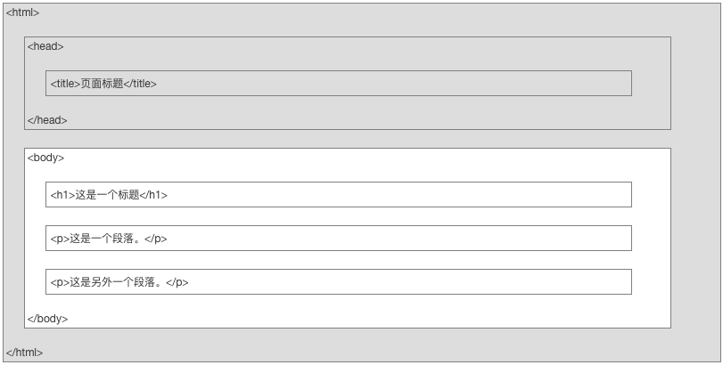
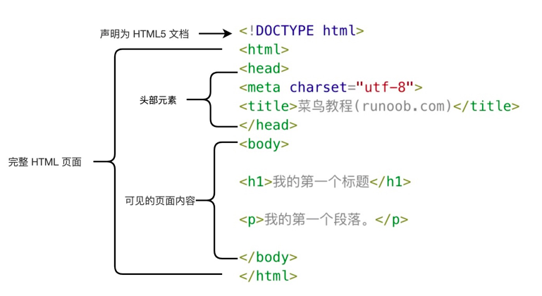

[Toc]

# 如何用HTML创建网页[^1]

[^1]: 这是学习html的个人笔记，是根据[菜鸟教程](https://www.runoob.com)所做

## HTML简介[^date1]

[^date1]: 2021.06.15

### 什么是html

* HTML: hypertext markup language(中文：超文本标记语言)
* 功能于与定位：一种用于`创建网页`或`web站点`的`标准标记语言`(html不是编程)
  * 标记语言是一套标记标签(markup tag)
  * html使用标记标签描述网页
  * html文档包含了html标签和文本内容
  * html文档也被称作`web页面`
  * html运行在浏览器中，并由浏览器简析
    > 标记语言(html)好比中文，一套标记标签(markup tag)好比一个个的汉字，网页(web)好比句子，html文档好比一篇中文文章
* html文件的后缀名：`<.html>`或`<.htm>`，两种后缀名可无区别的加以使用

### html标签(html元素)

* html标记标签又被称做html标签(html tag)
* html标签是由尖括号包围的关键词，如 `<html>`
* html标签通常成堆出现，如`<p>` content `</p>`
* 标签对中的第一个标签是开始标签(开放标签)，第二个标签是结束标签(闭合标签)
* html标签和html元素通常表述相同的意思

### web浏览器

* web浏览器用于读取html文档，并将其作为网页显示
* 浏览器并不直接显示html标签，它通过使用标签来决定如何展现html的页面内容给用户
* 常见的浏览器：Google，Safari，Internet Explorer，Firefox

### HTML版本

* html发展历程


### HTML的基本结构

* html的页面结构

  * Note：只有`<body>`内的内容才会显示在浏览器中

* html的==源代码==结构

  ```html
  <!DOCTYPE html>
  <html>
  <head>
  <meta charset="utf-8">
  <title>菜鸟教程(runoob.com)</title>
  </head>
  <body>
  <h1>我的第一个标题</h1>
  <p>我的第一个段落。</p>
  </body>
  </html>
  ```

* 含义解释


  * `<!DOCTYPE html>`：用于生命文档为html文档
  * `<html>`：html页面的根元素
  * `<head>`：包含文档的元(meta)数据
  * `<title>`：用于描述文档的标题
  * `<body>`：包含了可见页面的内容
  * `<h1>`：用于定义一个大标题
  * `<p>`：用于定义一个段落

* `<!DOCTYPE>`声明
  * 通过<!DOCTYPE>正确声明html的版本有助于在浏览器中正确显示网页内容[^声明方法]
  [^声明方法]: 声明方式参考[doctype参考手册](https://www.runoob.com/tags/tag-doctype.html)
  * 声明不区分大小写，如下属方式的声明是等价的:

     ```html
     <!DOCTYPE html>
     <!DOCTYPE HTML>
     <!doctype html>
     <!Doctype Html>
     ```

* 中文编码
  * 由于在大部分浏览器中，无法直接输入中文(乱码)，因此对于中文html，需要在html头部中将字符声明为UTF-8或GBK(360浏览器)，修改命令为：`<meta charset="utf-8">` 或`<meta charset="gbk">`

****

## 创建HTML的效率工具

### VScode[^download_site_vs]

[^download_site_vs]: VScode下载地址：https://code.visualstudio.com/

VScode全称visual Studio Code，作为`开放源代码`的`代码编辑器`，它由微软开发，并同时支持Windows, Linux, MacOS等多种平台的操作系统，它内置的拓插件功能使它能够作为各种代码程序的编辑器而备受青睐。

### Emmet插件[^site_em]

[^site_em]: Emmet官网：http://emmet.io/

* Emmet的出现大大提高了编码的速度，对于相应的使用方法可以参考官网的[说明手册](http://emmet.io/)

### Live Sever插件

* Live Sever可以实时查看编程的呈现结果
* 使用方法：
  * 点击右键，选择Open With Live Sever即可，或者使用快捷键 `Command L + Command O`
* ==注意事项==：
  * 使用Live Sever需要选择默认浏览器，这里可以进入VScode的设置-拓展-Live Sever Config中进行设置
  * 在使用Live Sever时，应该把包含html的整个文件夹一同放进VScode，否则会无法通过Live Sever打开html并进行实时预览
  * 实时预览的前提是代码已经被保存，可以每次手动保存或`command+A`，也可以通过`file-自动保存`设置成自动保存

****

# 用HTML创建网页的细节描述

## HTML基础

****

### HTML标题(heading)

* HTML通过标签`<h*>`定义标题，*代表1-6的数字，是几就是及级标题，最多6级标题
* 例如：

  ```html
  <body>

  <h1>title</h1>
  <h2>title</h2>
  <h3>title</h3>
  <h4>title</h4>
  <h5>title</h5>
  <h6>title</h6>

  </body>
  ```

## HTML段落

* HTML通过标签`<p>`定义
* 例如：

  ```html
  <body>

  <p>this is paragraph 1</p>
  <p>this is paragraph 2</p>

  </body>
  ```

## HTML链接

* HTML通过标签`<a>`定义

  ```html
  <body>

  <a href="https://www.runoob.com/html/html-basic.html">如何使用链接</a>

  </body>
  ```

  * Note：`href`属性用于指定链接地址

## HTML图像

* HTML通过标签``定义

  ```html
  <body>

  

  </body>
  ```

* 根据图片相对于html文档的位置的不同，引用的命令`src`也有所不同，[==后期补充==](https://www.runoob.com/html/html-basic.html)
* `href`与`src`的区别:
  * href是hypertext reference的缩写，表示超文本`引用`，用来建立当前元素与其它文档之间的链接，常用于`link`和`a`标签中
  * scr是source的缩写，它指向的内容会被`嵌入`到当前文档的当前标签位置，常用于`img`,`script`,`iframe`标签中
